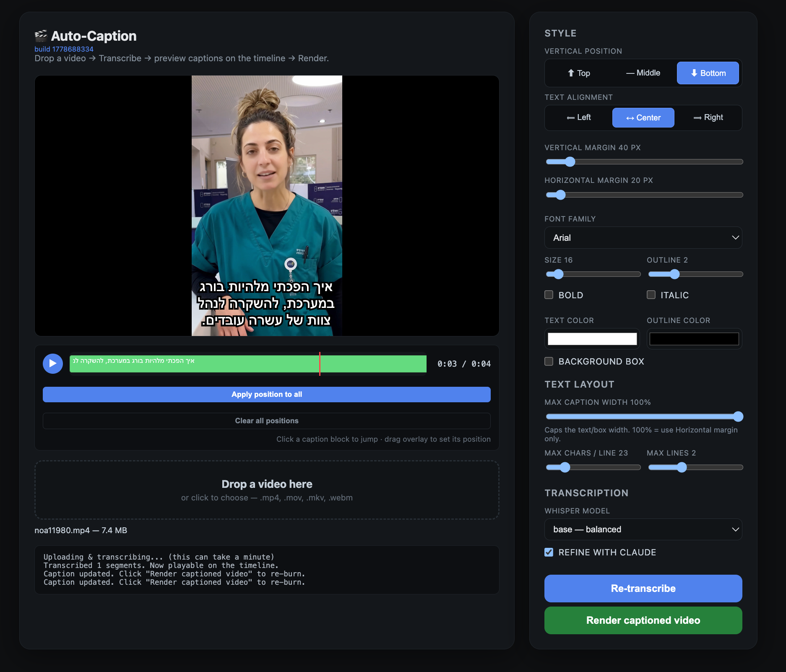

# Auto-Caption

A small FastAPI web app that auto-transcribes a video with OpenAI Whisper, optionally polishes the result with Claude, and burns styled captions into the video with FFmpeg + libass. Includes an in-browser editor with a timeline, drag-to-position overlays, and a live preview that matches the burned output closely.



## What it does

1. Upload a video → server runs Whisper to transcribe it.
2. (Optional) Claude rewrites the segments for punctuation, spelling, and line layout.
3. The browser shows each caption on a timeline. You can:
   - Click any segment to jump the player there.
   - Drag the caption overlay to position a specific segment anywhere on the frame.
   - "Apply position to all" to copy that position onto every segment.
   - Tune font, size, color, outline, background box, opacity, padding, margins, and a "Max caption width" wrap slider.
4. Click **Render captioned video** to burn the final captions in and download the result.

## Run locally

```bash
python3 -m venv .venv
source .venv/bin/activate
pip install -r requirements.txt

# Optional — enables Claude-based segment refinement.
export ANTHROPIC_API_KEY=...

python app.py
# or: uvicorn app:app --host 127.0.0.1 --port 8765 --reload
```

Open <http://127.0.0.1:8765>.

## Notes

- **FFmpeg:** the app prefers the `imageio-ffmpeg` static binary (bundled via pip), which includes libass. macOS Homebrew's `ffmpeg` 8.x ships without libass/drawtext and will not work — keep the bundled binary.
- **Whisper model:** defaults to `base`. Smaller (`tiny`) is fast, larger (`small`/`medium`/`large`) is more accurate. First run downloads the model.
- **Anthropic key (optional):** without it, refinement is skipped and Whisper's raw output goes through.
- **Coordinate system:** captions are rendered in libass "script units" with `PlayResY = 288` (aspect-corrected `PlayResX`). The browser preview mirrors that scale, so font / margin / padding sliders all preview at the same proportions they burn at.

## File layout

```
app.py                 FastAPI app + single-page HTML editor
caption_pipeline.py    Whisper, Claude refine, ASS writer, FFmpeg burn
requirements.txt       Python deps
```
